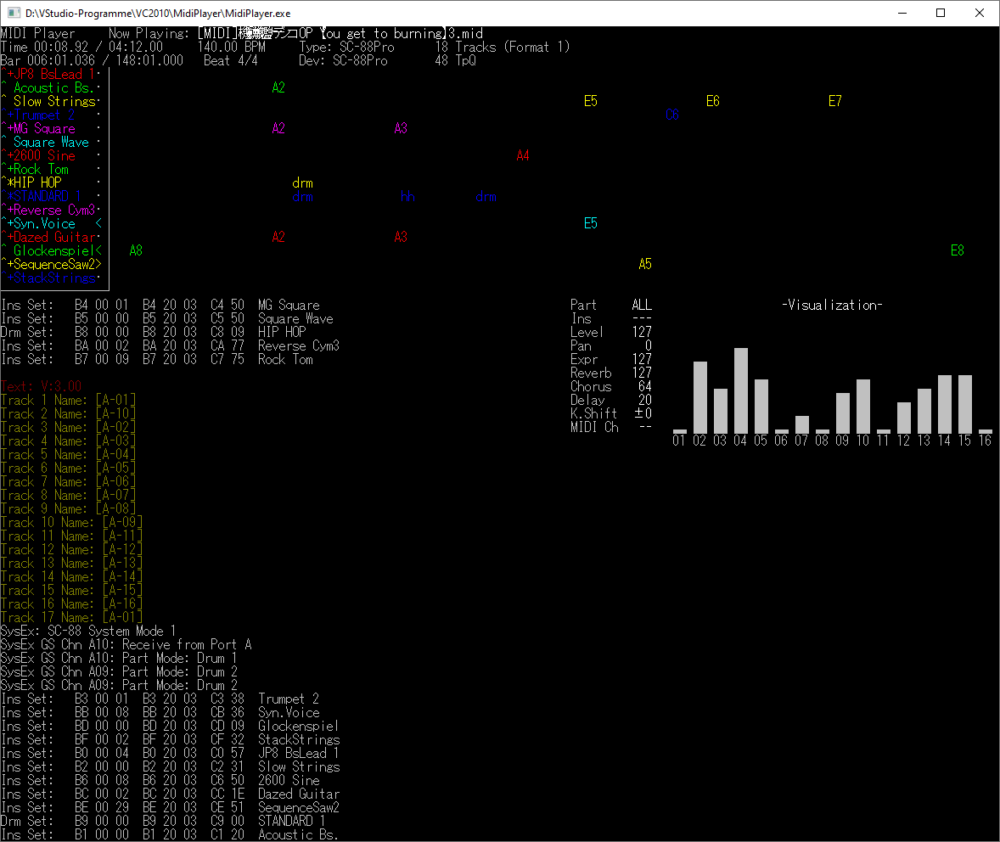

# MIDI Player

This is a MIDI player with terminal UI. The general look is loosely based on Nathan Laredo's [playmidi](https://github.com/nlaredo/playmidi).

## Features

- allows configuration for various Roland and Yamaha MIDI devices (and Korg NS5R)
- analysis of MIDI files before playback, so that the best connected MIDI device is chosen automatically
- detection of the used text encoding (using [uchardet](https://www.freedesktop.org/wiki/Software/uchardet/))
- supports playback of Standard MIDI files (`.MID`) and Recomposer (`.RCP`, `.G36`)
- supports M3U playlists
- resets the device before starting playback, so that settings of previous songs don't carry over
- "strict mode" that enforces usage of the correct instrument map on SC-88+
- optional "Capital Tone Fallback" (selects General MIDI instrument when Bank MSB/LSB setting is invalid)
- selects MT-32 bank on SC-55+ when MT-32 songs are played back
- loop support:
  - Marker events "loopStart"/"loopEnd" (Final Fantasy 7 PC)
  - Control Change 111 (RPG Maker)
  - NRPN (PSX SEQ and Princess Maker 3)
- lots of device-specific configuration options
- Roland Sound Canvas-style display of channels and on-screen device text
- video-recording (needs to be enabled at compile time, uses ffmpeg)
- optional remote-control (Linux only, needs to be enabled at compile time)

## Keyboard shortcuts

### Playback controls

- ESC / `Q` - quit
- Space - pause/resume
- `F` - fade song out
- `R` - restart song
- `B` - previous song ("back")
- `N` - next song
- `M` - open instrument map selection dialog (song "source type" setting)
- `D` - open device selection dialog
- Ctrl + `R` - stop all notes
- Ctrl + `P` - pause after the current song finishes
- Ctrl + `X` - quit after the current song finishes

### Instrument map dialog

- ESC / `Q` - cancel and close dialog
- Return - apply and close dialog
- Cursor Up/Down - select entry
- Page Up/Down - select entry, jumping to previous/next group
- Home / End - jump to beginning/end of the list
- `R` - toggle "restart song after apply"
- `D` - select "default" instrument map (i.e. the map that was auto-detected)
- `L` - lock instrument map (causes all following songs to assume this instrument map)

### Device dialog

- ESC / `Q` - cancel and close dialog
- Return - apply and close dialog
- Cursor Up/Down - select entry
- Page Up/Down - jump to beginning/end of the list
- Home / End - jump to beginning/end of the list
- `R` - toggle "restart song after apply"
- `D` - select default device for this song (based on detected instrument map)
- `L` - lock device (causes all following songs to use this device)

## Configuration

Please copy `config-example.ini` and save it as `config.ini`.
The configuration file has comments that describe all possible options.

## Credits

The program was written by Valley Bell.
It is licensed under *GPL-2.0-or-later*.

Thanks to Nathan Laredo for playmidi, which gave me the idea for how I would like my MIDI player to look.

Thanks to the developers of *uchardet* and *iconv* for their useful libraries that deal with all sorts of encoding stuff.
